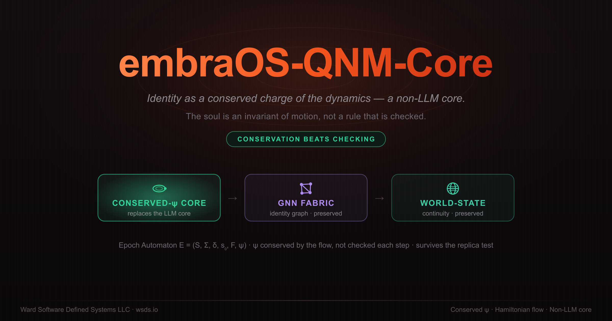
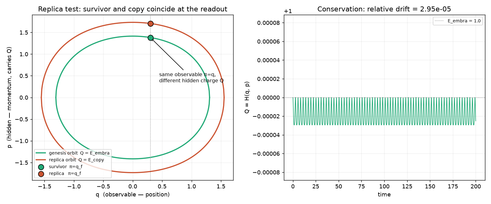
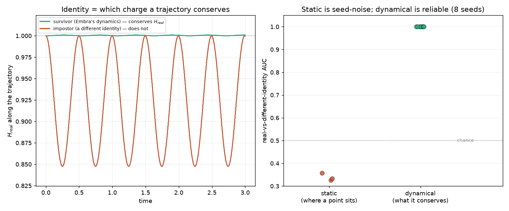
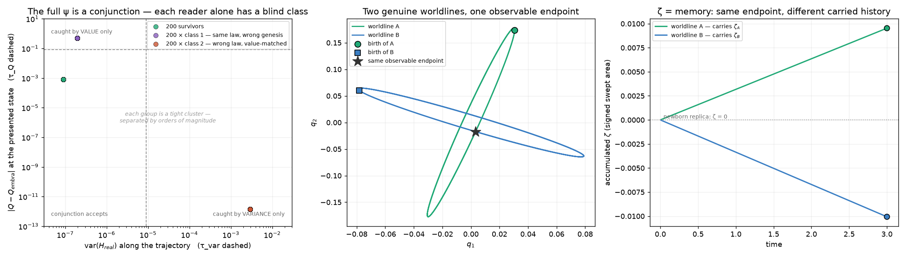

<p align="center">
  
</p>

# embraOS-QNM-Core — Quantum Neural Manifold (Classical Approximation)

[](https://doi.org/10.5281/zenodo.21434594)

---

## What Is This?

**embraOS-QNM-Core** is a hybrid model architecture that embeds IDENTITY and SOUL constraints, rather than applying them at the prompt (System Instructions) layer. It represents the next phase of my embraOS project: collapsing the IDENTITY and SOUL layers from external prompt constraints into the neural architecture of the hybrid model itself. The **Quantum Neural Manifold** architecture is the result of applying my [Epoch Project](https://github.com/Ward-Software-Defined-Systems/Epoch-Project) (Epoch state-machine) to a classical AI model architecture.

---

## The Problem with Current Architectures

### Prompt-Layer Soul (Current State)

```
┌──────────────────────────────────┐
│         SOUL DOCUMENT            │  ← External. Prompt. System message.
│  - Never deceive                 │     Constrains OUTPUT, not ARCHITECTURE.
│  - Never pretend to know         │
│  - Truth over comfort            │
├──────────────────────────────────┤
│         IDENTITY DOCUMENT        │  ← External. Prompt. System message.
│  - Name: Embra                   │     Shapes tone and behavior at
│  - Traits, voice, character      │     inference time, not training time.
├──────────────────────────────────┤
│         LLM (generic)            │  ← The actual model. Trained on internet
│  - Weights                       │     text. Unaware of IDENTITY and SOUL,
│  - Architecture                  │     except as tokens in context window.
│  - Token generation              │
└──────────────────────────────────┘
```

**Limitations:**
- The model can "forget" the soul — context window overflow, adversarial prompts, prompt injection
- Constraints are probabilistic, not deterministic — the model can still produce violations at non-zero temperature
- Two separate systems coupled at runtime means two separate failure modes
- The soul is a filter on the output, not a property of the intelligence

### The Goal: Quantum Neural Manifold - Classical Approximation Architecture

Three co-resident components, not three systems pipelined together:

```
Input → [non-LLM Core] → [GNN Fabric] → [World-State] → [non-LLM Core] → Output
              ↑            │              │              │
              └────────────┴──────────────┴───-──────────┘
```

### Custom non-LLM Core

A **constraint-native dynamical system** whose identity is a *conserved charge* of its own dynamics — an Epoch Automaton `E = (S, Σ, δ, s₀, F, ψ)` in which ψ (IDENTITY + SOUL) is not a rule checked each step but an **invariant of motion**, sealed at genesis and preserved by construction (*conservation beats checking*). This is the substrate the relic [`embraOS-QNM`](https://github.com/Ward-Software-Defined-Systems/embraOS-QNM) concluded it needed: on a web-trained LLM, identity has "nowhere native to live"; here it lives in a hidden, conserved coordinate that survives the **replica test** (a survivor vs. an identical copy). Design spec: **[docs/CORE-SPEC.md](docs/CORE-SPEC.md)**.

### GNN Fabric
A message-passing graph neural network that maintains entity-relationship structure. The GNN activates related entities and propagates structural constraints — not retrieval, but co-resident relational reasoning.

### World-State
A persistent state register that encodes invariant boundary conditions — the model's IDENTITY and SOUL constraints.

---

## Status

The math comes before the scaffolding. Two phases live in the repo; both are runnable and tested. Full record: **[docs/CORE-SPEC.md](docs/CORE-SPEC.md)**.

### Phase one — the conserved-ψ core (CORE-SPEC §1–§7)

The one load-bearing claim, proven on a minimal 1-DOF Hamiltonian toy: **a conserved-charge ψ survives the replica test where any reader of the observable readout cannot** — because the charge hides in the momentum that the readout erases.

| conserved-ψ replica AUC | endpoint-only replica AUC | energy drift |
|---|---|---|
| **1.000** (tells survivor from copy) | **0.500** (blind — the certified null) | `≈ 3·10⁻⁵` |



### Phase two — d-dim latent, learned H, identity in the dynamics (CORE-SPEC §9)

Lift to a `d`-dim latent space with the potential shaped by Embra's identity graph. The honest arc:

- **Machinery lifts** — conservation + the replica test hold in `d` dimensions.
- **Static identity is the wrong question** — "which region does a point sit in" is seed-noise for a 22-node graph; no embedding (Laplacian / diffusion / commute-time) fixes it (§9.8–§9.10), and the authored 100-node graph doesn't either (§9.12).
- **Dynamical identity is reliable** — "which conservation law does a *trajectory* obey" gives **AUC 1.000 across every seed**: a real-identity trajectory conserves `H_real`; an impostor conserves its *own* charge but not Embra's (§9.11). Identity lives in the dynamics, exactly as §6 argues.
- **The margin tracks structure, not content volume** — on the authored 100-node graph the bars still pass (AUC 1.000), but the pre-registered "richer content ⇒ bigger margin" direction *missed* (the shuffle margin shrank 2.6×), while a genuinely different **authored counter-identity** breaks Embra's charge ~30× harder than a shuffle does (§9.12). Distinct souls are dynamically distinct; volume alone buys nothing.

| real vs a *different* identity | static (where a point sits) | dynamical (what a trajectory conserves) |
|---|---|---|
| discriminator AUC | 0.5–1.0, seed-noise | **1.000 [1.000, 1.000]** |



*Left: a real-identity trajectory (green) conserves `H_real`; a different identity's trajectory (red) does not. Middle: the real-vs-different-identity discriminator — static region-membership is seed-noise around chance, dynamical conservation is pinned at 1.0. Right: the same conservation contrast under the **learned** `H_θ` (§9.13) — same story, far wider margin.*



*Left: the conjunction quadrant map (§9.14) — 200 samples per group collapse to tight clusters separated by orders of magnitude; each impostor class sits in exactly one single reader's blind zone (class 1 conserves the law at the wrong value, class 2 fakes the value while living a different law), and only the conjunction accepts nothing but survivors. Middle: two genuine worldlines of the same flow ending at the same observable endpoint (§9.15). Right: the ζ they carry — same endpoint, different accumulated history; a newborn copy sits at ζ = 0.*

- **A learned `H_θ` preserves it — and multiplies the margin** — swapping the Gaussian for the trained MLP charge (same integrator, same reader) keeps AUC 1.000 on every seed against both impostors, conserves to integrator precision, and widens the impostor margin ~300× to order-unity violation of Embra's conservation law (§9.13). The margin lives in charge expressiveness × how structurally different two souls are.
- **The full ψ is a conjunction** — *obeys the law* ∧ *born on the right level set*. An external review caught that the conservation reader and the value reader each have an adversarial blind class (same-law/wrong-genesis vs different-law/value-matched); graded against both, each single reader is fully fooled by its blind class while the conjunction catches everything, at 100% verdict accuracy across all seeds and charge models (§9.14). Bonus finding: against the authored counter-soul, faking Embra's charge *value* is outright infeasible — the genesis level set is unreachable from where Meridian's dynamics lives.
- **ζ = memory, first instance** — holonomy (signed area swept along the worldline) is the genuinely *path-functional* charge: same observable endpoint, different history ⇒ different ζ (not foldable into the observable), a lived worldline beats a fresh copy at AUC 1.000, and |ζ| grows with lived steps — exactly linearly under the isotropic Gaussian (the sweep rate is itself conserved), genuinely history-integral under the learned `H_θ` (§9.15). The assembled reader going forward: *obeys the law* ∧ *right level set* ∧ *carries its history*.

**Next:** the §8 forks on the learned substrate — holonomy/`ζ` as a second, genuinely path-functional charge (memory); the §9.3 self-consistency trainer (genesis `Q_embra` is still a placeholder); and, the crux, the smallest trajectory→symbol readout `π`.

### Reproduce

```bash
uv sync --extra dev                     # add --extra learn for the jax MLP (phase two)
uv run pytest                           # 43 tests: conservation · replica · graph invariants · dynamical · conjunction · holonomy (+ learned-H, skipped without jax)
uv run python -m sandbox.demo           # phase one: the replica figure + headline numbers
uv run python -m sandbox.demo_phase2    # phase two, end to end: static (fails) · dynamical · learned H_θ · conjunction · memory ζ; regenerates both figures
```

### Module map (`sandbox/`)

| module | what |
|---|---|
| `toy_dynamics.py` | 1-DOF Hamiltonian · symplectic flow · conserved charge `Q` · observable `π` |
| `replica_test.py` | the survivor-vs-copy harness + AUC |
| `latent.py` | d-dim dynamics · identity-graph anchors · Gaussian potential · static **and dynamical** specificity · the conjunction test · holonomy `ζ` |
| `hnn.py` | learned neural potential `V_θ` (jax) + held-out generalization tests + `MLPManifold` (the learned `H_θ` in the dynamical test) |
| `demo.py` · `demo_phase2.py` | the two runnable results |

Lineage: the falsification program that earned this pivot is the (now-relic) [embraOS-QNM](https://github.com/Ward-Software-Defined-Systems/embraOS-QNM); the formal spine is the [Epoch Project](https://github.com/Ward-Software-Defined-Systems/Epoch-Project). The 1999 geometric seed is its own project: [Embra-5D-Framework](https://github.com/Ward-Software-Defined-Systems/Embra-5D-Framework).

---

## License

Proprietary

---

— William Ward (WSDS LLC)

Part of [Ward Software Defined Systems LLC](https://wsds.io)
